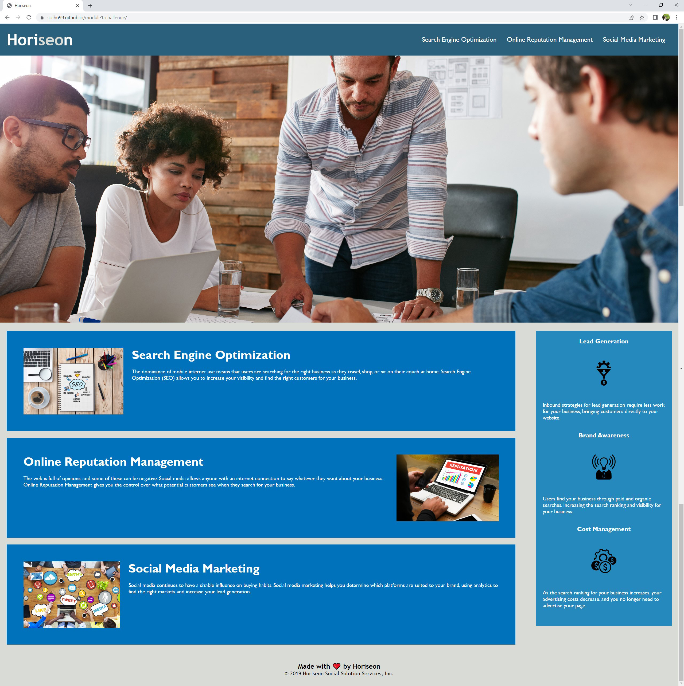

# Horiseon

## Description

Horiseon is a webpage for a marketing agency, providing information on their services, in order to help businesses increase visibility across the internet. It includes features to be more accessible, such as alt attributes, and is optimized for search engines.

## Usage

* Deployed link:
[Horiseon](https://sschu99.github.io/module1-challenge/)

 

## Built With

* VS Code

## License

Distributed under the MIT License.

## Contact
[Shuen Shuen Chu](https://github.com/sschu99)

## Acknowledgements

* Source code: 
* [CSS Tricks](https://css-tricks.com/how-to-section-your-html/)
* [w3 Schools](https://www.w3schools.com/html/html5_semantic_elements.asp)
* [Plural Sight](https://www.pluralsight.com/guides/semantic-html)